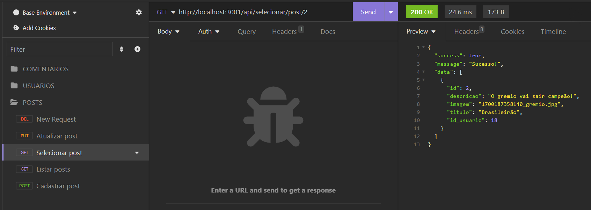
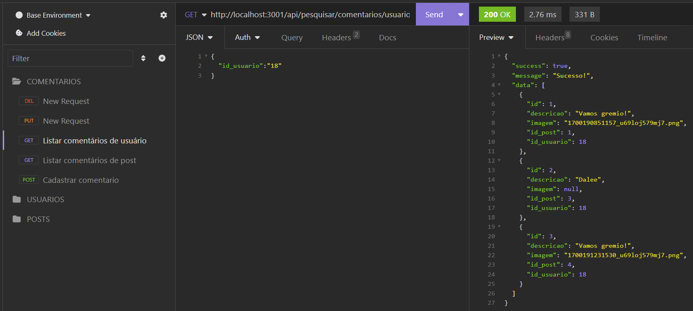

# Testes dos endpoints no insomnia

## Rotas de Usuarios: Métodos POST
### Cadastrar usuário
- http://localhost:3001/api/cadastrar/usuario

### Login

- http://localhost:3001/api/logar

## <b>Usuarios:</b> Métodos GET
### Selecionar usuário pelo id

- http://localhost:3001/api/selecionar/usuario/18

### Listar usuarios

- http://localhost:3001/api/listar/usuarios

### Pesquisar usuário pelo nome

- http://localhost:3001/api/pesquisar/usuario/Jul

## <b>Usuarios:</b> Método PUT
### Atualizar usuário

- http://localhost:3001/api/atualizar/usuario/18

## <b>Usuarios:</b> Método DELETE
### Deletar usuário

- http://localhost:3001/api/deletar/usuario/20

## > <b>Posts:</b> Método POST
### Cadastrar post

## > <b>Posts:</b> Métodos GET
### Listar posts

### Selecionar post

## > <b>Posts:</b> Métodos PUT
### Atualizar post

## > <b>Posts:</b> Métodos DELETE
### Deletar post

## > <b>Comentários:</b> Métodos POST
### Cadastrar comentário

## > <b>Comentários:</b> Métodos GET
#### Listar comentários de post

### Listar comentários de usuario

## > <b>Comentários:</b> Método PUT
### Atualizar comentário

## > <b>Comentários:</b> Método DELETE
### Deletar comentário

