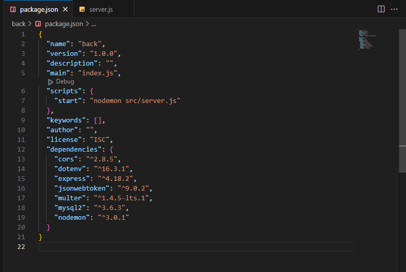

# CRUD REST API com Node, Express e MySql 👨‍💻

## Criando o banco de dados

* Utilizar as teclas CTRL + Enter para executar os comandos no workbench

### Criar a base de dados
```
create database backend_js;
```

### Selecionar a base
```
use backend_js;
```

### Criar tabela usuarios
```
CREATE TABLE `usuarios` (
  `id` int NOT NULL AUTO_INCREMENT,
  `nome` varchar(120) DEFAULT NULL,
  `email` varchar(120) UNIQUE DEFAULT NULL,
  `senha` varchar(120) DEFAULT NULL,
  `usuario` varchar(120) DEFAULT NULL,
  `perfil` varchar(120) DEFAULT NULL,
  `sexo` char(1) DEFAULT NULL,
  `dt_nascimento` date DEFAULT NULL,
  `imagem` varchar(120) DEFAULT NULL,
  PRIMARY KEY (`id`)
);
```

### Criar tabela posts
```
CREATE TABLE `posts` (
  `id` int NOT NULL AUTO_INCREMENT,
  `descricao` varchar(120) NOT NULL,
  `imagem` varchar(120) DEFAULT NULL,
  `titulo` varchar(120) DEFAULT NULL,
  `id_usuario` int NOT NULL,
  PRIMARY KEY (`id`),
  FOREIGN KEY (`id_usuario`) REFERENCES `usuarios` (`id`)
);
```

### Criar tabela comentarios
```
CREATE TABLE `comentarios` (
  `id` int NOT NULL AUTO_INCREMENT,
  `descricao` varchar(120) NOT NULL,
  `imagem` varchar(120) DEFAULT NULL,
  `id_post` int NOT NULL,
  `id_usuario` int NOT NULL,
  PRIMARY KEY (`id`),
  FOREIGN KEY (`id_post`) REFERENCES `posts` (`id`),
  FOREIGN KEY (`id_usuario`) REFERENCES `usuarios` (`id`)
);
```

## Criando a API

- Abrir o gitBash na área de trabalho (Open Git Bash here)

### Executar o comando
```
mkdir backend_js
```

### Acessar a pasta
```
cd backend_js
```

### Criar o arquivo package.json para gerenciar os pacotes do Node
```
npm init -y
```

### Instalar pacotes que vamos precisar para o projeto
```
npm i express nodemon mysql2 dotenv cors jsonwebtoken multer
```
Responsabilidades destes pacotes:

* express: framework web para construção da infraestrutura da API;
* nodemon: monitora as mudanças nos arquivos do projeto e reinicia automaticamente o servidor Node;
* mysql2: conectar e mandar comandos SQL para o banco;
* dotenv: gerencia as variáveis de ambiente dentro do projeto;
* cors: mecanismo usado para adicionar cabeçalhos HTTP que informam aos navegadores para permitir que uma aplicação Web seja executada em uma origem e acesse recursos de outra origem diferente;
* multer: usado principalmente para fazer upload de arquivos;

### Criar arquivo na raiz do projeto chamado .env com termial
```
touch .env
```

### Abrir o projeto no VSCode
```
code .
```

### Abrir o arquivo .env e digitar o conteúdo abaixo, conforme os comentários
```
# Definir a porta do servidor. Ex: 3000
PORT = 

# DB_HOST: Domínio do servidor. Ex: 'localhost'
# DB_USER: Usuário do banco de banco de dados. Ex: 'root'
# DB_PASSWORD: Senha do banco de banco de dados. Ex: 'root'
# DB_DATABASE: Nome da base de dados criada. Ex: 'projeto_final'
# DB_PORT: Porta que MySql está instalado. Ex: '3306' ou '3308'

DB_HOST = 
DB_USER = 
DB_PASSWORD =
DB_DATABASE =
DB_PORT =
```

### Criar arquivo na raiz do projeto chamado .gitignore com terminal
```
touch .gitignore
```

### Abrir o arquivo '.gitignore' no VSCode e digitar o conteúdo abaixo
```
node_modules
.env
```

### Criar uma pasta 'src' na raiz do no projeto
```
mkdir src
```

### Dentro da pasta 'src', criar o arquivo 'app.js' e colar o código:
```
// importar configurações para as rotas
const express = require('express');
const cors    = require('cors');
const app     = express();
require('dotenv').config();

// importar arquivos de rotas
const userRouter  = require('./routes/usersRouter');
const loginRouter = require('./routes/loginRouter');
const postsRouter = require('./routes/postsRouter');
const comentariosRouter = require('./routes/comentariosRouter');

app.set('port', process.env.PORT);
app.use(cors());
app.use(express.json());

// habilitar as rotas na aplicação
app.use('/api', userRouter);
app.use('/api', loginRouter);
app.use('/api', postsRouter);
app.use('/api', comentariosRouter);

module.exports = app;
```

### Depois de criar o arquivo 'app.js', vamos criar o 'server.js' dentro da pasta 'src' e colar o código:
```
const app = require('./app');
const port = app.get('port');

app.listen(port, () => {
  console.log(`Running at port ${port}`);
})
```

## Configurar o comando para rodar e testar a API

### Abra o arquivo 'package.json' do projeto e vamos editar a chave 'scripts' alterando o comando 'test' com a seguinte linha:
```
"start": "nodemon src/server.js"
```

#### Visualização do arquivo 'package.json', após alteração



### Para testar se o servidor esta funcionando, vamos rodar o comando com o terminal
```
npm run start
```

## Criar a configuração com o banco de dados

### Dentro da pasta 'src', vamos criar uma pasta de nome 'config'. Dentro desta pasta vamos criar um arquivo com nome 'db.js' e colar o código:
```
// Arquivo responsável pela configuração e conexão com o banco de dados
 
// Importar o pacote do mysql
const mysql = require('mysql2');

// Importar o pacote de acesso aos de variáveis de ambiente
require('dotenv').config();

// Estabelece a criação da conexão com banco 
const connection = mysql.createConnection({
    host: process.env.DB_HOST,
    user: process.env.DB_USER,
    password: process.env.DB_PASSWORD,
    database: process.env.DB_DATABASE,
    database: process.env.DB_PORT
});

// Testa se o banco esta conectado
connection.connect((err) => {
  if (err) {
    console.log(`Erro na conexão com banco: ${err}`);
  } else {
    console.log("Mysql Connected!");
  }
});

module.exports = connection;
```

## Criar a configuração de upload de arquivos

### Dentro da pasta 'config', vamos criar um arquivo com nome 'multer.js' e colar o código:

```
const multer = require("multer");

var storage = multer.diskStorage({
    destination: function (req, file, cb) {
        return cb(null, "./src/public");
    },
    filename: function (req, file, cb) {
        return cb(null, `${Date.now()}_${file.originalname}`);
    }
});

var upload = multer({ storage });

module.exports = upload;
```

## Criar uma pasta para salvar as imagens no servidor

### Dentro da pasta 'src', vamos criar uma pasta de nome 'public'

```
mkdir src/public
```

## Criar os controllers da aplicação

### Dentro da pasta 'src', vamos criar uma pasta de nome 'controllers', dentro desta pasta vamos criar um arquivo com nome 'usersController.js' e colar o código:

```
const connection = require('../config/db');

async function salvarUsuario(request, response) {
  const query = 'INSERT INTO usuarios(nome, email, senha, usuario, perfil, sexo, dt_nascimento, imagem) values(?,?,?,?,?,?,?,?);';

  const params = Array(
    request.body.nome,
    request.body.email,
    request.body.senha,
    request.body.usuario,
    request.body.perfil,
    request.body.sexo,
    request.body.dt_nascimento,
    request.file.filename
  );

  connection.query(query, params, (err, results) => {
    try {
      if (results) {
        response
          .status(200)
          .json({
            success: true,
            message: 'Sucesso!',
            data: results
          })
      } else {
        response
          .status(400)
          .json({
            success: false,
            message: 'Não deu sucesso!',
            query: err.sql,
            sqlMessage: err.sqlMessage
          })
      }
    } catch (error) {
      response
        .status(500)
        .json({
          success: false,
          message: 'Não deu sucesso! ',
          data: error
        })
    }
  });
};

async function listarUsuarios(request, response) {
  const query = "SELECT * FROM usuarios";

  connection.query(query, (err, results) => {
    if (results) {
      response
        .status(200)
        .json({
          success: true,
          message: "Sucesso!",
          data: results
        });
    } else {
      response
        .status(400)
        .json({
          success: false,
          message: "Deu erro!",
          query: err.sql,
          sqlMessage: err.sqlMessage
        });
    }
  })
}

async function selecionarIdUsuario(request, response) {
  const query = "SELECT * FROM usuarios WHERE id = ?;";

  const params = Array(
    request.params.id
  );

  connection.query(query, params, (err, results) => {
    if (results) {
      response
        .status(200)
        .json({
          success: true,
          message: 'Sucesso!',
          data: results
        });
    } else {
      response
        .status(400)
        .json({
          success: false,
          message: 'Não deu sucesso!',
          query: err.sql,
          sqlMessage: err.sqlMessage
        });
    }
  })
}

async function pesquisarNomeUsuario(request, response) {
  const query = "SELECT * FROM usuarios WHERE nome LIKE ?;";

  const params = Array(
    request.params.nome
  );

  connection.query(query, `%${params}%`, (err, results) => {
    if (results) {
      response
        .status(200)
        .json({
          success: true,
          message: 'Sucesso!',
          data: results
        });
    } else {
      response
        .status(400)
        .json({
          success: false,
          message: 'Não deu sucesso!',
          query: err.sql,
          sqlMessage: err.sqlMessage
        });
    }
  })
}

async function atualizarUsuario(request, response) {
  const query = "UPDATE usuarios " +
  " SET nome = ?, email = ?, senha = ?, usuario = ?, perfil = ?, sexo = ?, dt_nascimento = ?, imagem = ? " +
  " WHERE id = ?;";

  const params = Array(
    request.body.nome,
    request.body.email,
    request.body.senha,
    request.body.usuario,
    request.body.perfil,
    request.body.sexo,
    request.body.dt_nascimento,
    request.file ? request.file.filename : null,
    request.params.id
  );

  connection.query(query, params, (err, results) => {
    if (results) {
      response
        .status(200)
        .json({
          success: true,
          message: 'Sucesso!',
          data: results
        });
    } else {
      response
        .status(400)
        .json({
          success: false,
          message: 'Não deu sucesso!',
          query: err.sql,
          sqlMessage: err.sqlMessage
        });
    }
  })
}

async function deletarUsuario(request, response) {
  const query = "DELETE FROM usuarios WHERE id = ?;";

  const params = Array(
    request.params.id
  );

  connection.query(query, params, (err, results) => {
    if (results) {
      response
        .status(200)
        .json({
          success: true,
          message: 'Sucesso!',
          data: results
        });
    } else {
      response
        .status(400)
        .json({
          success: false,
          message: 'Não deu sucesso!',
          query: err.sql,
          sqlMessage: err.sqlMessage
        });
    }
  })
}

module.exports = {
  salvarUsuario,
  listarUsuarios,
  selecionarIdUsuario,
  pesquisarNomeUsuario,
  atualizarUsuario,
  deletarUsuario
}
```

### Dentro da pasta 'controllers', vamos criar um arquivo com nome 'loginController.js' e colar o código:

```
// importa as configurações do banco
const connection = require('../config/db');
// importa o pacote para gerar token
const jwt = require('jsonwebtoken');

async function login(request, response) {
  // constrói a consulta no banco
  const query = 'SELECT * FROM usuarios WHERE email = ?;';

  // recupera o e-mail enviado do formulário
  const params = Array(
    request.body.email
  );

  // executa a consulta no banco pelo e-mail recebido
  connection.query(query, params, (err, results) => {
    // varifica se existe usuario com o email recebido    
    if (results) {
      // recupera os dados do usuario
      const dadosUsuario = results[0];
      // valida senha recebido do formulário e a existente no banco
      if (dadosUsuario.senha === request.body.senha) {        
        const id = dadosUsuario.id;
        
        // criando token de acesso a aplicação
        const token = jwt.sign(
          { id },   // payload: informações como o identificador do usuário
          'token',      // chave secreta: A ideia é que só você saiba a sua chave secreta e que ela seja difícil a fim de dificultar a ação de ataques maliciosos
          { expiresIn: '1h' } // opcionais
        );
        
        response
          .status(200)
          .json({
            success: true,
            message: 'Sucesso!',
            data: dadosUsuario,
            token: token
          })
      }
    }
  })
}

module.exports = {
  login
};
```


### Dentro da pasta 'controllers', vamos criar um arquivo com nome 'postsController.js' e colar o código:

```
const connection = require('../config/db');

async function salvarPost(request, response) {
  const query = "INSERT INTO posts(descricao, imagem, titulo, id_usuario) values(?,?,?,?)";

  const params = Array(
    request.body.descricao,
    request.file.filename,
    request.body.titulo,
    request.body.id_usuario
  );

  connection.query(query, params, (err, results) => {
    if (results) {
      response
        .status(200)
        .json({
          success: true,
          message: "Sucesso!",
          data: results
        })
    } else {
      response
        .status(400)
        .json({
          success: false,
          message: 'Não deu sucesso!',
          query: err.sql,
          sqlMessage: err.sqlMessage
        })
      }
  })
}

async function listarPosts(request, response) {
  const query = "SELECT * FROM posts";

  connection.query(query, (err, results) => {
    if (results) {
      response
        .status(200)
        .json({
          success: true,
          message: "Sucesso!",
          data: results
        });
    } else {
      response
        .status(400)
        .json({
          success: false,
          message: "Deu erro!",
          query: err.sql,
          sqlMessage: err.sqlMessage
        });
    }
  })
}

async function selecionarIdPost(request, response) {
  const query = "SELECT * FROM posts WHERE id = ?;";

  const params = Array(
    request.params.id
  );
  
  connection.query(query, params, (err, results) => {
    if (results) {
      response
        .status(200)
        .json({
          success: true,
          message: 'Sucesso!',
          data: results
        });
    } else {
      response
        .status(400)
        .json({
          success: false,
          message: 'Não deu sucesso!',
          query: err.sql,
          sqlMessage: err.sqlMessage
        });
    }
  })
}

async function atualizarPost(request, response) {
  const query = "UPDATE posts " +
  " SET descricao = ?, imagem = ?, titulo = ?, id_usuario = ? " +
  " WHERE id = ?;";

  const params = Array(
    request.body.descricao,
    request.file ? request.file.filename : null,
    request.body.titulo,
    request.body.id_usuario,
    request.params.id
  );

  connection.query(query, params, (err, results) => {
    if (results) {
      response
        .status(200)
        .json({
          success: true,
          message: 'Sucesso!',
          data: results
        });
    } else {
      response
        .status(400)
        .json({
          success: false,
          message: 'Não deu sucesso!',
          query: err.sql,
          sqlMessage: err.sqlMessage
        });
    }
  })
}

async function deletarPost(request, response) {
  const query = "DELETE FROM posts WHERE id = ?;";

  const params = Array(
    request.params.id
  );

  connection.query(query, params, (err, results) => {
    if (results) {
      response
        .status(200)
        .json({
          success: true,
          message: 'Sucesso!',
          data: results
        });
    } else {
      response
        .status(400)
        .json({
          success: false,
          message: 'Não deu sucesso!',
          query: err.sql,
          sqlMessage: err.sqlMessage
        });
    }
  })
}

module.exports = {
  salvarPost,
  listarPosts,
  selecionarIdPost,
  atualizarPost,
  deletarPost
}
```

### Dentro da pasta 'controllers', vamos criar um arquivo com nome 'comentariosController.js' e colar o código:

```
const connection = require('../config/db');

async function salvarComentario(request, response) {
  const query = "INSERT INTO comentarios(descricao, imagem, id_post, id_usuario) values(?,?,?,?)";

  const params = Array(
    request.body.descricao,
    request.file.filename,
    request.body.id_post,
    request.body.id_usuario
  );

  connection.query(query, params, (err, results) => {
    if (results) {
      response
        .status(200)
        .json({
          success: true,
          message: "Sucesso!",
          data: results
        })
    } else {
      response
        .status(400)
        .json({
          success: false,
          message: 'Não deu sucesso!',
          query: err.sql,
          sqlMessage: err.sqlMessage
        })
      }
  })
}

async function listarComentariosPost(request, response) {
  const query = "SELECT c.* " +
  " FROM comentarios c, posts p " +
  " WHERE c.id_post = p.id AND p.id = ?;";

  const params = Array(
    request.body.id_post
  );

  connection.query(query, params, (err, results) => {
    if (results) {
      response
        .status(200)
        .json({
          success: true,
          message: "Sucesso!",
          data: results
        });
    } else {
      response
        .status(400)
        .json({
          success: false,
          message: "Deu erro!",
          query: err.sql,
          sqlMessage: err.sqlMessage
        });
    }
  })
}

async function listarComentariosUsuario(request, response) {
  const query = "SELECT c.* " +
  " FROM comentarios c, usuarios u " +
  " WHERE c.id_usuario = u.id AND u.id = ?;";

  const params = Array(
    request.body.id_usuario
  );

  connection.query(query, params, (err, results) => {
    if (results) {
      response
        .status(200)
        .json({
          success: true,
          message: "Sucesso!",
          data: results
        });
    } else {
      response
        .status(400)
        .json({
          success: true,
          message: "Deu erro!",
          query: err.sql,
          sqlMessage: err.sqlMessage
        });
    }
  })
}

async function atualizarComentario(request, response) {
  const query = "UPDATE comentarios " +
  " SET descricao = ?, imagem = ?, id_post = ?, id_usuario = ? " +
  " WHERE id = ?;";

  const params = Array(
    request.body.descricao,
    request.file ? request.file.filename : null,
    request.body.id_post,
    request.body.id_usuario,
    request.params.id
  );

  connection.query(query, params, (err, results) => {
    if (results) {
      response
        .status(200)
        .json({
          success: true,
          message: 'Sucesso!',
          data: results
        });
    } else {
      response
        .status(400)
        .json({
          success: false,
          message: 'Não deu sucesso!',
          query: err.sql,
          sqlMessage: err.sqlMessage
        });
    }
  })
}

async function deletarComentario(request, response) {
  const query = "DELETE FROM comentarios WHERE id = ?;";

  const params = Array(
    request.params.id
  );

  connection.query(query, params, (err, results) => {
    if (results) {
      response
        .status(200)
        .json({
          success: true,
          message: 'Sucesso!',
          data: results
        });
    } else {
      response
        .status(400)
        .json({
          success: false,
          message: 'Não deu sucesso!',
          query: err.sql,
          sqlMessage: err.sqlMessage
        });
    }
  })
}

module.exports = {
  salvarComentario,
  listarComentariosPost,
  listarComentariosUsuario,
  atualizarComentario,
  deletarComentario
}
```

## Criar as rotas da aplicação

### Dentro da pasta 'src', vamos criar uma pasta de nome 'routes'. Dentro desta pasta vamos criar um arquivo com nome 'usersRouter.js' e digitar o código:

```
const {Router} = require('express');
const router = Router();
const upload = require('../config/multer');

const {
  salvarUsuario,
  listarUsuarios,
  selecionarIdUsuario,
  pesquisarNomeUsuario,
  atualizarUsuario,
  deletarUsuario
} = require('../controllers/usersController')

router.post('/cadastrar/usuario', upload.single('imagem'), salvarUsuario);
router.get('/listar/usuarios', listarUsuarios);
router.get('/selecionar/usuario/:id', selecionarIdUsuario);
router.get('/pesquisar/usuario/:nome', pesquisarNomeUsuario);
router.put('/atualizar/usuario/:id', upload.single('imagem'), atualizarUsuario);
router.delete('/deletar/usuario/:id', deletarUsuario);

module.exports = router;
```

### Dentro da pasta 'routes', vamos criar um arquivo com nome 'loginRouter.js' e colar o código:

```
const {Router} = require('express');
const router = Router();

const {
  login
} = require('../controllers/loginController')

router.post('/logar', login);

module.exports = router;
```

### Dentro da pasta 'routes', vamos criar um arquivo com nome 'postsRouter.js' e colar o código:

```
const {Router} = require('express');
const router = Router();
const upload = require('../config/multer');

const {
  salvarPost,
  listarPosts,
  selecionarIdPost,
  atualizarPost,
  deletarPost
} = require('../controllers/postsController')

router.post('/cadastrar/post', upload.single('imagem'), salvarPost);
router.get('/listar/posts', listarPosts);
router.get('/selecionar/post/:id', selecionarIdPost);
router.put('/atualizar/post/:id', upload.single('imagem'), atualizarPost);
router.delete('/deletar/post/:id', deletarPost);

module.exports = router;
```

### Dentro da pasta 'routes', vamos criar um arquivo com nome 'comentariosRoutes.js' e colar o código:

```
const {Router} = require('express');
const router = Router();
const upload = require('../config/multer');

const {
  salvarComentario,
  listarComentariosPost,
  listarComentariosUsuario,
  atualizarComentario,
  deletarComentario
} = require('../controllers/comentariosController')

router.post('/cadastrar/comentario', upload.single('imagem'), salvarComentario);
router.get('/pesquisar/comentarios/post', listarComentariosPost);
router.get('/pesquisar/comentarios/usuario', listarComentariosUsuario);
router.put('/atualizar/comentario/:id', upload.single('imagem'), atualizarComentario);
router.delete('/deletar/comentario/:id', deletarComentario);

module.exports = router;
```